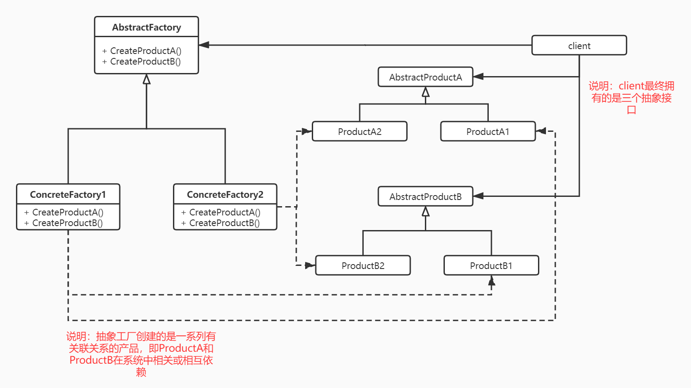
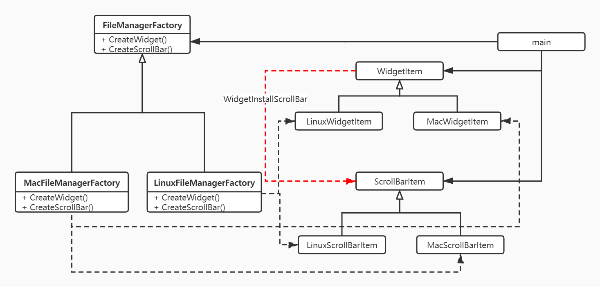

## AbstractFactory

- 意图：提供一个接口以创建*一系列相关或相互依赖的对象*，而无须指定他们具体的类。
- UML关系图
  
- 适用场景
  - 一个系统要独立于他的产品创建、组合和表示
  - 一个系统要由多个产品系列中的一个来配置
  - 强调一系列相关的产品对象的设计以便进行联合适用
  - 提供一个产品类库，但只想显示他们的接口而不是实现
- 情景开发
  - 情景说明  
    木公是一个桌面客户端的开发人员，他接到一个任务需要为一个文件管理器开发一个界面，这个界面包含的元素(产品)基本固定下来：只有一个窗口（Widget）和一个滚动条（ScrollBar）---可能是功能最不全和最单一的文件管理器。产品说：这个界面我们只投放到Mac平台上，需求就是实现功能，界面风格符合Mac平台的风格。木公心想：我信你个鬼，糟老头子坏得很！！事情哪能那么简单，指不定哪天这货又让我适配到Linux平台上。不行，我得好好设计一下！！哈哈哈，聪明的一休。。。啊呸。。。聪明的你一定能够想到好的方式帮助他！
  - 思路  
    按照上述UML关系图进行映射
    

        这里我自己在关系图上多增加了一条WidgetItem到ScrollBar的关联关系，实际场景的含义是：得到滚动条需要被安装在窗口中，否则用个鬼！ 这也意在说明抽象工厂使用的场景：一系列相关或相互依赖的对象。由于MacFileManagerFactory和LinuxFileManagerFactory的存在，使得这种关联关系存在一种约束，也就是你不太可能在一个mac风格的widget中安装一个Linux风格的ScrollBar。当然，这里说的不太可能主要是指，在你正常开发的过程不太可能。。。如果你是一个非正常的程序员，你硬要用两种风格的factory分别创建Widget和ScrollBar，那么。。。你的想象力可是有点强！！！

    | uml class        | mugong class            |
    | ---------------- | ----------------------- |
    | AbstractFactory  | FileManagerFactory      |
    | ConcreteFactory1 | MacFileManagerFactory   |
    | ConcreteFactory2 | LinuxFileManagerFactory |
    | AbstractProductA | WidgetItem              |
    | ProductA1        | MacWidgetItem           |
    | ProductA2        | LinuxWidgetItem         |
    | AbstractProductB | ScrollBarItem           |
    | ProductB1        | MacScrollBarItem        |
    | ProductB2        | LinuxScrollBarItem      |

  - 实践 [talk is cheap, show me your code!](./AbstractFactory.cpp)

  