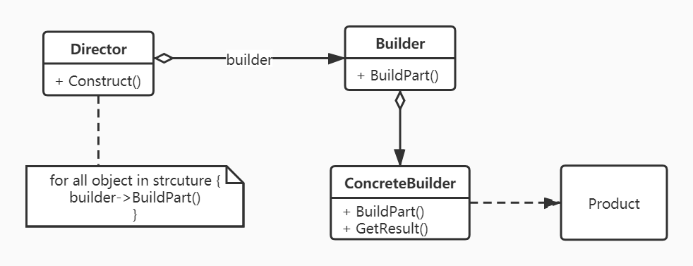
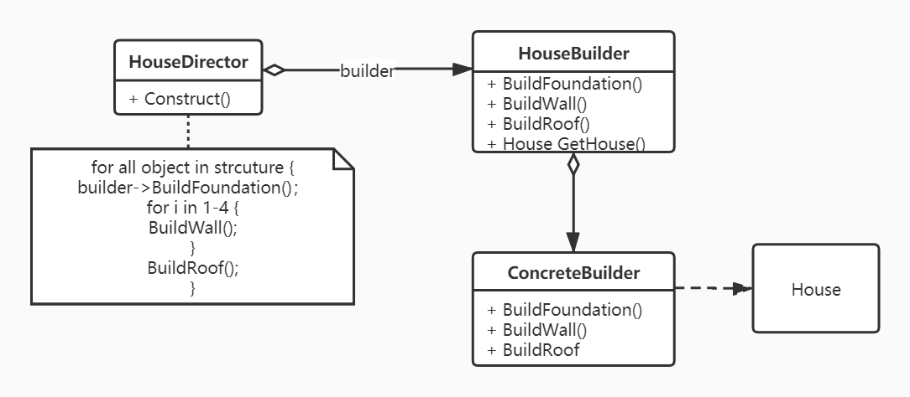

## Builder 

- 意图：将一个复杂对象的构建和他的表示分离，使得同样的构建过程可以创建不同的表示。
- UML关系图
  
- 适用场景
    - 当创建复杂对象的算法(稳定部分)应该独立于该对象组成部分以及它们的装配方式时。
    - 当构造过程必须允许对象有不同的表示时。
- 情景开发
  - 情景说明  
    “为杜甫盖房子”项目：项目经理在阅读了《茅屋为秋风所破歌中》，深深感慨于杜甫生活方式之艰难，同时又折服于古代文人在此等艰难的环境中，思想又不滑坡，反而是忧国忧民，一句“安得广厦千万间，大辟天下寒士俱欢颜”道尽热忱之心。为了做点贡献，他想新建"广厦千万间"，据他浅薄的知识，他觉得，"茅草屋"和"广厦"建造方法(构建过程)一样嘛，就是用的材料不一样(对象的表示)，那么，你用学习到的设计模式帮帮这个操心的项目经理吧。
  - 思路
  
    情境中已经介绍清楚，这种属于构造过程相对稳定，但是对象有不同的表示，最后得出不同的产品，比较适合使用构造模式。
  - 类映射表
    | uml class       | mugong class    |
    | --------------- | --------------- |
    | Product         | House           |
    | Director        | HouseDirector   |
    | Builder         | HouseBuilder    |
    | ConcreteBuilder | MaoCaoBuilder   |
    | ConcreteBuilder | GuangShaBuilder |

  - 实践 [talk is cheap, show me your code!](./Builder.cpp)