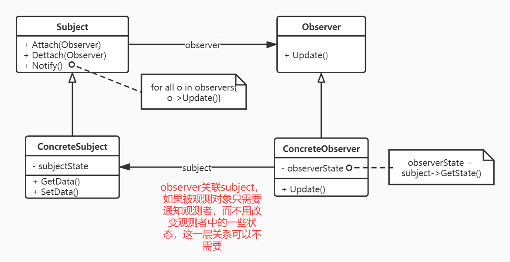
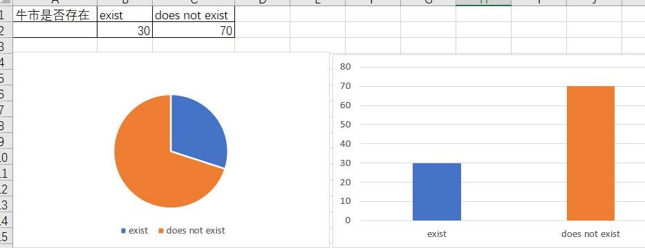

## Observer

- 意图: 定义对象间的一种一对多的依赖关系，当一个对象的状态发生改变时，所有依赖于他的对象都得到通知并自动更新。
- UML关系图
  
- 适用场景
  - 一个抽象的模型有两个方面，其中一个方面依赖于另一方面，可以将两者封装在独立的对象中，以使得他们可以各自独立的改变和复用。（基金的定投中，买入和卖出动作的发生依赖于当前基金的收益率是否达到目标值，将二者抽象为观察者的模型）
  - 对一个对象的改变需要同时改变其他对象，而不知道具体有多少对象有待改变。(excel在表格中改变数据后同时变化饼图和柱状图)
  - 一个对象必须通知其他对象，而她又不能假定其他对象是谁，也就是说对象之间解耦。(大学上课答到，其中一个人去了教室，如果老师点名的话他要通知班上其他同学赶紧过来，这里的其他同学不一定都有哪些)
- 情景开发
  - 情景说明
    在excel中我们经常有这样的场景：根据表格的数据生成的柱状图和饼图之后，我们任意改变数据源、饼图、柱状图其中之一的数据，其他表现形式的图样也会随之改变。现在对于当前比较火热的牛市是否存在的话题，调研显示有两种态度和声音，下面对他们进行数据的展示如下(数据是我瞎编的)：
    
    另外，这里我们假设我们可以通过拖动扇形图和柱状图来更改sheet栏中的数据，且同时需要反馈在另外一种形式中。现在，尝试通过观察者模式完成这个问题吧。
  - 思路
    // todo
  - 类映射表
  - 实践[talk is cheap, show me your code!](./Observer.cpp)