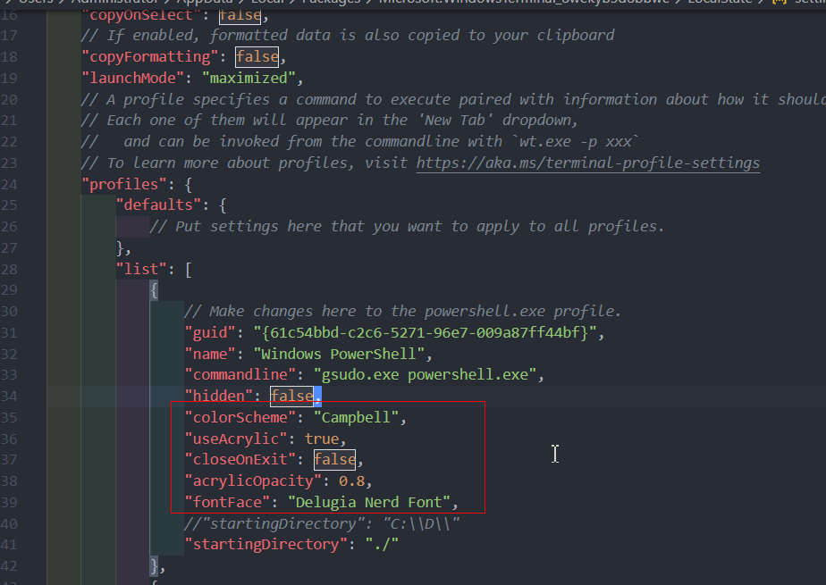

# windows开发环境安装部署

- 为什么是windows？  
  因为我的mac电脑归还了。。。。

废话也不多说了，安装环境部署大概分为开发相关安装、windows terminal安装及美化。

## 开发相关安装
### 编辑器安装
- vscode
  - 请动动你的小手指点击[这里](https://code.visualstudio.com/download)下载安装包
  - 然后就是运行安装，选择路径，下一步下一步下一步，同意同意同意。。。。
  - 插件：（没有插件的vscode是没有灵魂的）
    - C/C++：开发C++必备
    - clang-format：配置后面安装的clang-format，完成代码的自动格式化，省心又省力
    - git graph/git history：不用说，git相关
    - one dark pro：挑选一个花花的主体
    - remote-ssh：远程开发需要的插件
    - vim：没有vim插件，代码不再有爱
    - LeetCode：vscode中刷题插件，emmm，别问我为什么要这个插件
    - markdown all in one：makr down插件，现在我就是在mark down里面里面写这玩意
    - koroFileHeader: 快速生成头文件注释和函数注释的插件
  - 配置
    - clang-format配置：在设置中搜索“clang-format”关键字，在user选项卡下配置下面几个：
      - Executable：clang-format的路径，取决于你安装clang的路径
      - Style：配置风格化方式，支持file(根据.clang-format配置进行风格化)、Google等，此处我配置file
      - Fallback Style：当没找到file文件的时候，默认的风格化选项，配置为Google
      - 其他：还可以指定各种语言的style和Fallback Style，这里不再赘述。
      - 这里给一个示例的.clang-format配置:
        ```json
          Language: Cpp
          BasedOnStyle: Google
          DerivePointerAlignment: false
          PointerAlignment: Right
          ColumnLimit: 10
        ```
    - 编译配置：在设置中搜索“compile path”关键字，会有让你edit in setting.json的字样，在打开的json文件中添加下面这些选项。(具体的路径取决于各自安装mingw的路径)  
        ```json
         "C_Cpp.default.intelliSenseMode": "gcc-x64",
          "C_Cpp.default.compilerPath": "C:\\D\\ProgramFile\\mingw-w64\\x86_64-8.1.0-posix-seh-rt_v6-rev0\\mingw64\\bin\\g++.exe",
         "C_Cpp.default.cppStandard": "c++17",
         "C_Cpp.default.cStandard": "c18
         ```
- sublime
  - 没啥可以说，点击[下载](http://www.sublimetext.com/)
  
### IDE安装
- Clion
  - why 好处有点多，谁用谁知道（智能提示、跳转精准（语义层面的解析）、版本控制、live template、Refactor（重构及其方便）等等等等），缺点费内存
  - 安装：点击[下载](https://www.jetbrains.com/clion/download/other.html)。下载下来当时是next next next、同意、同意、同意了。（注：笔者写这篇文章的时候，破解包出到202001，但是官网202001最新的软件是2020.1.2，下载下来死活破解不成功。后面灵机一动想到换个版本试试，于是改成2020.1.1，就能够成功破解）
  - 破解 ：破解软件网上一大把，找不到的话这里贴个[链接](https://pan.baidu.com/s/15cT3LqaE_1Ckpntw2WSYpg) 提取码：ukt1,内部有详细破解和汉化的流程。
  - 插件
    - IdeaVim
    - Key PromoterX ：快捷键提示和统计
  - 配置
    - tool chain配置编译器,如下图
    
    - 开启clang-format：Editor->Code Style->Enable Clangformat
    - 配置头文件注释模板，在File-->settings-->Editor-->File and templates下：
      ```C++
        #if ($HEADER_COMMENTS)
        /**
         * @file ${FILE_NAME}
         * @author yuansong
         * @date ${DATE}
         * @brief xxx
         */
        #end
      ```
- Goland
  - 安装：点击[下载](https://www.jetbrains.com/go/download/other.html),版本仍然是2020.1.1
  - 破解：使用和clion一样的破解软件和破解方法
  - 配置
    - GOROOT-系统环境变量中增加go(注意是go语言包)的安装路径
    - PATH-PATH环境变量增加%GOROOT%/bin路径
    - GOPATH-GOPATH会作为一些插件和包的默认下载路径，且可以为每个项目监理自己的GOPATH路径，我理解应该类似于C++的include路径，这里可以自己指定一个路径作为全局的GOPATH路径
    - run配置：goland点击运行代码之后，通过生成临时二进制文件并运行。所以当前目录下不会产生目标文件。若要生成目标文件，则在Edit Configuration中进行配置，如下图：
    

### 编译器安装
- mingw
  - what：Minimalist GNU for Windows, windows下最小的gnu开发环境。mingw编译器为windows下提供一套运行时环境，同时提供包括gcc、bash、make等工具链。下面是官方网址的介绍：
    ```
    MinGW compilers provide access to the functionality of the Microsoft C runtime and some language-specific runtimes. MinGW, being Minimalist, does not, and never will, attempt to provide a POSIX runtime environment for POSIX application deployment on MS-Windows. If you want POSIX application deployment on this platform, please consider Cygwin instead.
    ```
  - why：与mingw对应的编译器还有clang以及微软的msvc，但是因为windows版本的clang安装之后c++的基础库没有，还是依赖于mingw或者msvc链接基础库，所以没有选择clang。没选择msvc的原因呢，嫌太笨重。
    - 注：关于为什么是mingw，还有很多人会经常将其与cygwin进行对比，这里两者还是有本质的区别，cygwin更像是类似java虚拟机的一套中间介质，连接了windows和POSIX的系统库。而mingw则只是一套单纯的开发套件。stack overflow的[这里](https://stackoverflow.com/questions/771756/what-is-the-difference-between-cygwin-and-mingw)有更多关于两者之间区别的描述。有个总结是：在mingw下编译的产物你是为了在windows下使用；在cygwin下编译的产物则是为了在cygwin下使用。
  - 安装：废话不多说，点击[这里](https://sourceforge.net/projects/mingw-w64/)下载64bit进行安装，和32bit相比支持的特性更多。安装后在ide（clion）和编辑器（vscode）中可以进行配置。
- clang
  - what：编译器+1
  - why：前面已经得到一个mingw的编译器，这里为啥还要在安装一个。主要是为了使用clang-format的格式化软件啦。。。。。
  - 安装：[地址](https://releases.llvm.org/download.html)。安装后也是在ide和编辑器中进行配置。

## windows terminal安装及美化
这一章的主要目的是在windows下得到一个美观、高可用的终端，别和我说虚拟机和wsl2，我都装了，但我还是要一个本地的windows terminal。
### git for windows安装
- 目的：使用linux下的常用的命令，在windows的安装目录下将windows系统挂载为linux下的根目录，支持更多的linux命令。
- 地址：[下载](https://gitforwindows.org/)
### windows terminal安装
- 系统要求：window10 18362.0及以上 
- 下载：商店搜索windows terminal下载
- 调侃：windows果然为了成为最好的linux发行版本做着不懈的努力。显示wsl2，然后是windows terminal，虽然windows terminal原生的界面和字体还是很丑，不过，值得优化。
### windows terminal美化
- 效果预览：支持添加git bash终端、powershell终端，毛玻璃特效、配置oh-my-posh等等。
  
- 安装步骤(下面涉及的步骤均在管理员权限下的power shell中进行)
  - 安裝choco包管理器（[choco官网](https://chocolatey.org/install), choco就是类似centos下得yum、ubuntu下得apt-get，包管理的设计哲学就是避免你在网上搜索待安装包、在众多结果中选择其中一个的这个步骤)  
	在powershell中（注意管理員權限）執行下面的命令，如果失敗就多執行幾次,下面的命令呢。。其实可以在官网的安装指南中获取:
  ```
	Set-ExecutionPolicy Bypass -Scope Process -Force; [System.Net.ServicePointManager]::SecurityProtocol = [System.Net.ServicePointManager]::SecurityProtocol -bor 3072; iex ((New-Object System.Net.WebClient).DownloadString('https://chocolatey.org/install.ps1'))
  ```
  - 安裝gsudo解決windows terminal管理員權限的問題：  
	  `choco install gsudo`  
  然後在windows terminal的配置文件中更改commandline參數：  
    `"commandline": "gsudo.exe powershell.exe",`
  
  - 安装Oh-my-posh
  ```
    choco install ConEmu
    Install-Module posh-git -Scope CurrentUser
    Install-Module oh-my-posh -Scope CurrentUser
  ```
  - 设置Profile脚本
  ```bash
  if (!(Test-Path -Path $PROFILE )) { New-Item -Type File -Path $PROFILE -Force }  // 创建profile文件

  notepad $PROFILE      // 打开profile文件 添加下面的三行代码

  Import-Module posh-git
  Import-Module oh-my-posh
  Set-Theme Paradox
  ```
  - 关闭脚本禁用：允许Powershell运行脚本  
  `set-executionpolicy remotesigned`
  - 安装个性化字体：[地址](https://github.com/adam7/delugia-code/releases/download/v1910.04.1/Delugia.Nerd.Font.Complete.ttf)
  - windows terminal设置：完成上述步骤后，可以进行windows terminal的设置（ctrl+,快捷键打开）
  
  这里有一根我自己的配置文件可以进行参考：[配置文件](./source/window_develop/settings.json)
  - 添加右键终端：windosw下运行下面的bat脚本。其中wt的路径为windows terminal的路径，Icon是自己指定的一个图标，没有的话可以用仓库里面[终端图标](./source/window_develop/terminal.ico)
  ```
  Windows Registry Editor Version 5.00

  [HKEY_CLASSES_ROOT\Directory\Background\shell\wt]
  @="Windows Terminal here"
  "Icon"="C:\\Users\\Administrator\\Pictures\\terminal.ico"

  [HKEY_CLASSES_ROOT\Directory\Background\shell\wt\command]
  @="C:\\Program Files\\WindowsApps\\wt.exe"
  ```
  - 快捷键启动：choco install winhotkey,然后配置快捷键指向对应的应用程序

## 象征性总结
洗洗睡吧~~困

